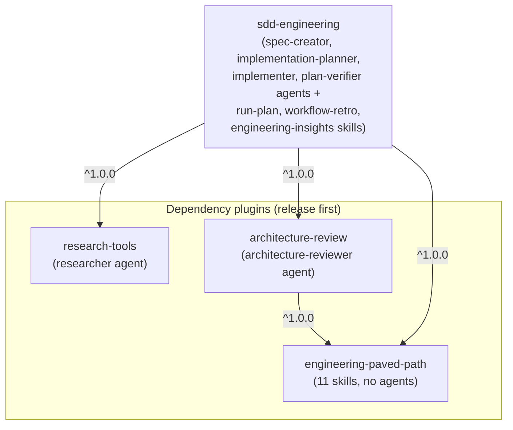

# dev-digest-ai-marketplace

A standalone Claude Code plugin marketplace that extracts the reusable half
of DevDigest's `.claude/` engineering harness into four installable plugins
— `engineering-paved-path`, `research-tools`, `architecture-review`, and
`sdd-engineering` — published through a `.claude-plugin/marketplace.json`
manifest, with a static discovery catalog served on GitHub Pages.

**Status: scaffolding only, Phase 1 of the extraction** — the top-level
directory structure and root tooling files exist, but no plugin content,
manifest, or site code has landed yet. See the
[`viptech/dev-digest` architecture spec](https://github.com/viptech/dev-digest/blob/main/docs/specs/marketplace-extraction/architecture.md)
for the full multi-phase plan.

## Plugin dependency graph (target)



## Layout

- `plugins/` — the four plugins listed above (stubs for now).
- `docs/` — contribution, site, security, release, and cost-baseline
  documentation. See [`docs/PLUGIN-GUIDELINES.md`](docs/PLUGIN-GUIDELINES.md),
  [`docs/SITE-SPEC.md`](docs/SITE-SPEC.md),
  [`docs/SECURITY.md`](docs/SECURITY.md),
  [`docs/RELEASES.md`](docs/RELEASES.md), and
  [`docs/COST-BASELINE.md`](docs/COST-BASELINE.md).
- `scripts/` — build and release tooling (empty for now).
- `site/` — the GitHub Pages catalog SPA (empty for now).

See [`CONTRIBUTING.md`](CONTRIBUTING.md) for where to start.

## CI

- [`.github/workflows/site.yml`](.github/workflows/site.yml) — runs on
  pull requests, builds the catalog index and the `site/` SPA (does not
  publish). Reproduce it locally with:

  ```sh
  npm ci && npm run build:index && npm test
  cd site && npm ci && npm test && npm run build
  ```

- [`.github/workflows/pages.yml`](.github/workflows/pages.yml) — runs on
  push to `main`, rebuilds the same way, and publishes `site/dist` to
  GitHub Pages.

## Evals

- [`evals/README.md`](evals/README.md) — behavior evals for the extracted plugins, proving the
  `sdd-engineering` composition loaded purely from `plugins/**` (no `.claude/` folder in this
  repo) behaves per the lab Крок 7 checklist, including the negative case. Reproduce the
  structural gate locally with:

  ```sh
  cd evals && npm ci && npm run typecheck
  ```

## License

[MIT](LICENSE)
